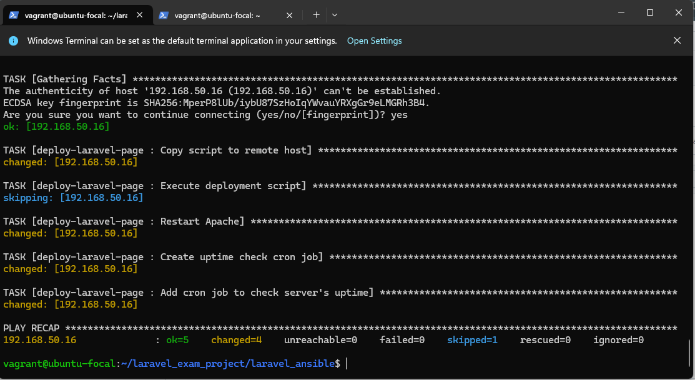
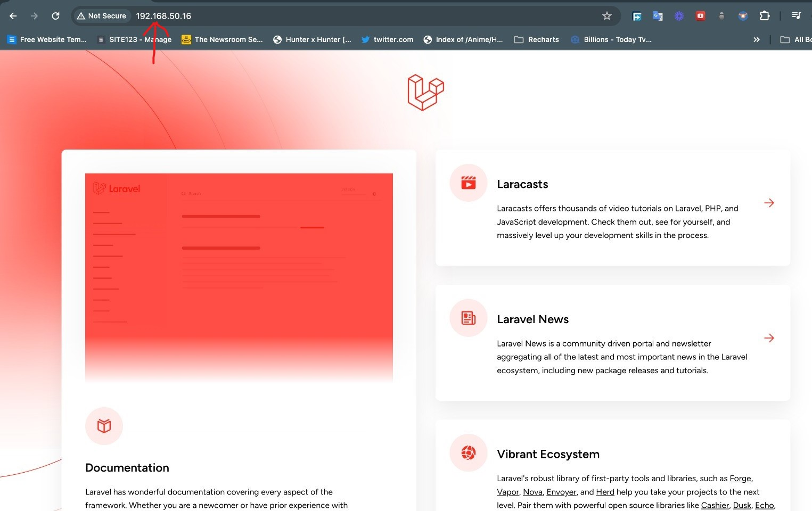

# **Cloud Engineering Second Semester Examination Project**

## **Automating LAMP Stack Deployment with Vagrant and Ansible**

## **Objective**
The objective of this project is to automate the provisioning of two Ubuntu-based servers, named "Master" and "Slave", using Vagrant. On the Master node, a bash script is created to automate the deployment of a LAMP (Linux, Apache, MySQL, PHP) stack. This script clones a PHP application from GitHub, installs all necessary packages, and configures Apache web server and MySQL. An Ansible playbook is used to execute the bash script on the Slave node and verify that the PHP application is accessible through the VM’s IP address. Additionally, a cron job is created to check the server’s uptime every 12 am.

## **Prerequisites**
1. Vagrant: Install Vagrant.
1. Virtualization Provider: Install VirtualBox or VMware.
1. Git: Install Git.
1. Text Editor: Have a text editor installed.
1. GitHub Account: Sign up for a GitHub account.
1. Understanding of Vagrant and Ansible: Have a foundational understanding of Vagrant and Ansible.

### **Configuration of Vagrantfile**
To successfully carry out this task, the first step is to edit the configuration of your default vagrantfile. This guide will show you how to use Vagrant to easily set up two virtual Ubuntu servers. We'll call them "Master" and "Slave". This will help you to quickly create consistent environments to work on, saving you time and making it easier to grow your system as needed. We'll be using a Vagrantfile to tell Vagrant exactly what to set up on the servers, so anyone can easily follow the steps to provision similars servers on their end. 

To configure you vagrantfile, go to the directory where the file is located and run `ls` to confirm it within that directory. Thereafter, using your preferred text editor either "nano or vi", enter the vagrantfile using `vi vagrantfile`. Within the vagrantfile make the follow changes as shown in the image below. 
  
 ```
  config.vm.define "master" do |master|
    master.vm.box = "ubuntu/focal64"
    master.vm.network "private_network", ip: "192.168.50.15"
    # You can add more configurations specific to master here
  end

  # Define Slave
  config.vm.define "slave" do |slave|
    slave.vm.box = "ubuntu/focal64"
    slave.vm.network "private_network", ip: "192.168.50.16"
    # You can add more configurations specific to master here
  end
  ```

After successfully editing the vagrantfile, run the command below
```
vagrant up
```
Then open two terminals, one for your **Master and another for the Slave**, then ssh into them using the command;
```
vagrant ssh master
vagrant ssh slave
```
You should get a prompt similar to this when you enter into both servers.  
**Master**  
  
**Slave**  

## **Establishing SSH Connection Between Master and Slave**  
After configuring the Vagrantfile, the next crucial step is establishing a secure SSH connection between the Master and Slave nodes, and this can be done using the following steps. 
**Generate SSH Keys:** I began by generating SSH keys on my master server using the command:
```
ssh-keygen
```
**Copy SSH Key to Slave:** Once the keys are generated, I copied the public key to the Slave node. This can be done using the following command to copy the SSH key to the Slave node:
```
ssh-copy-id vagrant@192.168.50.16
```
**Configure SSH Authentication on Slave:** SSH into the Slave node and navigate to the SSH configuration file:
```
sudo vi /etc/ssh/sshd_config
```
Within this file, I ensured that **PasswordAuthentication** was set to **yes** to enable password authentication, while **PubkeyAuthentication** was set to **yes** to enable public key authentication. Once satisfied, I saved the changes and exited the editor.

**Reloading SSH Service:** To ensure the new configurations come into effect immediately, I reloaded the SSH service on the Slave node:
```
sudo systemctl reload sshd
```
**Testing SSH Connection:** Returning to the Master server, I put the setup to the test by attempting to SSH into the Slave server.
```
ssh vagrant@192.168.50.16
```
## **Creating a Bash Script for LAMP Automation**
 I began by creating a dedicated directory for this project and proceeded to write a comprehensive bash script. Creating the directory, I used the command:
 ```
 mkdir laravel_exam_project && cd laravel_exam_project
 ```

Writing my bash script, I started by defining the variables within the script.  
**NAME:** I used it to specify the name of the web application directory (web_app). This variable ensures consistent referencing throughout the script.  
**LOCATION:** This indicates the path where the web application will be stored `(/var/www/$NAME)`. It dynamically generates the full path based on the *NAME* variable.  
**DATABASE:** It identifies the name of the database to be created for the project *(ProjectDB)*. Called it *ProjectDB* to identify it easily.
**USERNAME:**  Used it to define the username for accessing the MySQL database *(BetterGreat)*. It sets a secure and memorable username for database access.  
**PASSWORD:** Specifies the password for accessing the MySQL database *(s3cur3P@ssw0rd)*. This variable sets secure access credentials for database operations.  
```
# Variables
NAME="web_app"
LOCATION="/var/www/$NAME"
DATABASE="ProjectDB"
USERNAME="BetterGreat"
PASSWORD="s3cur3P@ssw0rd"
```
I then created a function which updates package repositories, installs Apache2, adds the PHP repository, and installs PHP along with its necessary dependencies. It ensures that the environment is properly configured for running PHP applications by enabling the required modules. The goal is to prepare the server environment with all the necessary components for hosting the web application smoothly.  
```
# Function to update and install packages
setup_environment() {
    echo "Updating package repositories..."
    sudo apt update -y 
    echo "Installing Apache2..."
    sudo apt install apache2 -y 
    echo "Adding PHP repository..."
    sudo add-apt-repository ppa:ondrej/php -y 
    sudo apt update -y
    sudo apt-get update -y 
    echo "Installing PHP and dependencies..."
    sudo apt install php8.2 php8.2-curl php8.2-dom php8.2-mbstring php8.2-xml php8.2-mysql zip unzip git -y 
    sudo a2enmod php8.2 
    echo "Environment setup completed."
}
```
 I also created a function which installs Composer, a dependency manager for PHP, by downloading the installer script from the official Composer website. This executes the installer script using PHP, moves the Composer executable to the `/usr/local/bin` directory, and renames it to simply `composer`. This ensures that Composer is readily available for managing PHP dependencies within the project
 ```
 # Function to install Composer
get_composer() {
    echo "Installing Composer..."
    cd /usr/local/bin
    sudo curl -sS https://getcomposer.org/installer | sudo php -q
    sudo mv composer.phar composer
    echo "Composer installation completed."
}
```
I developed a function, **clone_project**, which simplifies setting up a new web project. It's clones and then moves to a common directory for web projects `(/var/www/)`. It uses git clone to download your project from the source Github. It then sets ownership of the downloaded files  to the user account for full control. Finally, it confirms everything is downloaded and ready for you to use. 
```
# Function to clone repo and set ownership
clone_project() {
    echo "Cloning project repository..."
    cd /var/www/
    sudo git clone https://github.com/laravel/laravel.git $NAME
    sudo chown -R $USER:$USER $LOCATION
    echo "Project cloned and ownership set."
}
```
I created a funnction, `setup_dependencies` function installs the dependencies required by the project using Composer. It navigates to the project directory `($LOCATION)` and executes composer install to install the dependencies specified in the composer.json file. Additionally, it updates the dependencies to their latest versions. This ensures that all necessary libraries and packages are installed, optimized, and ready for use. Furthermore, I used the `create_env_file function` to create an `.env file` for configuring environmental variables. It copies the `.env.example` file to .env within the project directory `($LOCATION)`. It then sets appropriate ownership permissions for certain directories `($LOCATION/storage and $LOCATION/bootstrap/cache)` to ensure they are writable by the web server. 
```
# Function to install Composer dependencies
setup_dependencies() {
    echo "Installing Composer dependencies..."
    cd $LOCATION
    composer install --no-interaction --optimize-autoloader --no-dev
    composer update --no-interaction
    echo "Composer dependencies installed."
}

# Function to create .env file
create_env_file() {
    echo "Creating .env file..."
    sudo cp $LOCATION/.env.example $LOCATION/.env
    sudo chown -R www-data $LOCATION/storage
    sudo chown -R www-data $LOCATION/bootstrap/cache
    echo ".env file created."
} 
```  
 I created a function, `configure_server `  function which setup the Apache web server to host the LAMP application. It creates a virtual host configuration file in the `/etc/apache2/sites-available/` directory, specifying essential settings like the server name, document root, and directory access permissions. By enabling this newly created virtual host configuration using a2ensite, it ensures that Apache is aware of and can serve the web application seamlessly. Simultaneously, it disables the default virtual host configuration (000-default.conf) to prevent potential conflicts and guarantee that the newly configured virtual host takes precedence. Finally, it provides confirmation of the successful configuration of the Apache server.
```
# Function to configure Apache
configure_server() {
    echo "Configuring Apache server..."
    sudo tee /etc/apache2/sites-available/$NAME.conf > /dev/null <<EOF
<VirtualHost *:80>
    ServerName 192.168.50.16
    DocumentRoot $LOCATION/public
    <Directory $LOCATION>
        AllowOverride All
    </Directory>
    ErrorLog \${APACHE_LOG_DIR}/$NAME-error.log
    CustomLog \${APACHE_LOG_DIR}/$NAME-access.log combined
</VirtualHost>
EOF
    sudo a2ensite $NAME.conf > /dev/null 2>&1
    sudo a2dissite 000-default.conf > /dev/null 2>&1
    echo "Apache server configured."
}
```
I then created the `setup_database` which is the storage space for our web application's data. It starts by installing MySQL, a database management system, to handle our data storage needs. Once installed, it ensures that MySQL is up and running smoothly. Then, it creates a new database specifically for our project, named after the project's name. Additionally, it sets up a user account with limited access rights, ensuring security. Finally, it grants this user full control over the database, so our web application can interact with it effectively. Once everything's in place, it  confirms that MySQL is now installed.
```
# Function to install and configure MySQL
setup_database() {
    echo "Installing and configuring MySQL..."
    sudo apt install mysql-server mysql-client -y
    sudo systemctl start mysql
    sudo mysql -uroot -e "CREATE DATABASE $DATABASE;"
    sudo mysql -uroot -e "CREATE USER '$USERNAME'@'localhost' IDENTIFIED BY '$PASSWORD';"
    sudo mysql -uroot -e "GRANT ALL PRIVILEGES ON $DATABASE.* TO '$USERNAME'@'localhost';"
    echo "MySQL installed and configured."
}
```
I used the `configure_env` function to customize settings of the web application, ensuring it's ready to run smoothly. It adjusts the configuration file `(.env)` to match our setup. It replaces certain lines to switch from using `SQLite to MySQL` for our database, updates the database connection details with the chosen name, username, and password, ensuring everything aligns perfectly with our setup. Once done, it confirms that the `.env file` is now configured. Then I proceeded to create the `run_artisan` function which sets up key configurations, create symbolic links for file storage, migrate our database schema, and seed our database with initial data. This ensures that the web application is properly initialized and ready to use. Once all commands are executed, it confirms that the Artisan commands are successfully completed.
```
# Function to modify .env file
configure_env() {
    echo "Configuring .env file..."
    sudo sed -i "23 s/^#//g" $LOCATION/.env
    sudo sed -i "24 s/^#//g" $LOCATION/.env
    sudo sed -i "25 s/^#//g" $LOCATION/.env
    sudo sed -i "26 s/^#//g" $LOCATION/.env
    sudo sed -i "27 s/^#//g" $LOCATION/.env
    sudo sed -i '22 s/=sqlite/=mysql/' $LOCATION/.env
    sudo sed -i '23 s/=127.0.0.1/=localhost/' $LOCATION/.env
    sudo sed -i '24 s/=3306/=3306/' $LOCATION/.env 
    sudo sed -i '25 s/=laravel/='$DATABASE'/' $LOCATION/.env
    sudo sed -i '26 s/=root/='$USERNAME'/' $LOCATION/.env
    sudo sed -i '27 s/=/='$PASSWORD'/' $LOCATION/.env
    echo ".env file configured."
}

# Function to run artisan commands
run_artisan() {
    echo "Running artisan commands..."
    cd $LOCATION
    sudo php artisan key:generate
    sudo php artisan storage:link
    sudo php artisan migrate
    sudo php artisan db:seed
    echo "Artisan commands executed."
}
```
I created the `restart_server` function to use simple command to restart the server and then confirm that the action has been completed. The `deploy` function then calls various setup functions. It prepares the server environment, installs necessary software, and then proceeds with configuring and starting services like Apache and MySQL. It ensures your web application's codebase is cloned, dependencies are installed, and necessary configurations, such as the .env file and database settings, are properly established. By running the `deploy function`, I was able to automate the entire setup process from start to finish, making it reusable and easy to  deploy the web application with minimal effort. 
```
# Function to restart Apache
restart_server() {
    echo "Restarting Apache server..."
    sudo systemctl restart apache2
    echo "Apache server restarted."
}

# Main deployment function
deploy() {
    setup_environment
    restart_server
    get_composer
    clone_project
    setup_dependencies
    create_env_file
    configure_server
    restart_server
    setup_database
    configure_env
    run_artisan
    restart_server
    echo "Deployment successful!"
}
```
When you run the bash script, who should see various parts as shown in the images below to confirm, it is installing properly. 
   

To confirm the bash script is running succesfully, the ip address of the master is pasted on the browser to test if the laravel page will load. Here is the result. 
  


## **Automating Bash Script on Slave Using Ansible**
To be able to deploy the bash script on my slave machine using Ansible, It was neccessary to create a few files and directories within the already created `laravel-exam-project` directory. Here is the structure I used for my ansible.
- **laravel_ansible/:** This is the root directory for annsible.   
- **hosts:** Lists the servers where Ansible will run tasks.
- **roles/:** Contains the deploy-laravel-page role.
- **files/:** Holds the laravel.sh script for deployment.
- **tasks/:** Defines main tasks in the main.yml file for setting up the environment and deploying the Laravel application.
- **laravel_site.yml:** The main playbook orchestrating the deployment process.
```
laravel_ansible/
├── hosts
├── roles/
│   └── deploy-laravel-page/
│       ├── files/
│       │   └── laravel.sh
│       └── tasks/
│           └── main.yml
└── laravel_site.yml
```
In the **hosts file**, I defined the IP addresses of the master and slave machines under their respective groups. 
```
[master]
192.168.50.15

[slave]
192.168.50.16
```

Next, I created the site.yml file, which will be the entry point for the Ansible playbook.
```
---
- hosts: slave
  become: true
  roles:
    - deploy-laravel-page
```

Then a created a directory called **roles** and within it, another directory called ** deploy-web-app**. In the `roles/deploy-web-app/files/` directory, I placed my laravel.sh script by moving it to this directory. 
```
mkdir roles && cd roles
mkdir deploy-web-app && cd deploy-laravel-page
mkdir files && cd files

mv /laravel-exam-project/laravel.sh /laravel-exam-project/laravel-ansible/roles/deploy-laravel-page/files/
```


Then I created the `roles/deploy-web-app/tasks/main.yml file`, which will contain the tasks to be executed on the slave machine:
```
---
- name: Copy script to remote host
  copy:
     src: laravel.sh
     dest: /tmp/laravel.sh
     mode: 0755

- name: Execute deployment script
  command: /tmp/laravel.sh

- name: Restart Apache
  service:
     name: apache2
     state: restarted

- name: Create uptime check cron job
  cron:
     name: "Check server uptime"
     minute: "0"
     hour: "0"
     job: "uptime >> /var/log/uptime.log"

- name: Add cron job to check server's uptime
  lineinfile:
     path: /etc/crontab
     line: "0 0 * * * root uptime >> /var/log/uptime.log"
     lineinfile:
         path: /etc/crontab
         line: "0 0 * * * root uptime >> /var/log/uptime.log
```

To run and ensure the ansible is properly configured, use the command below. The check command is used to test it first before deploying it on the slave server. 
```
ansible-playbook -i hosts site.yml --check
ansible-playbook -i hosts site.yml
```
Below is the reuslt of the deployment.  
**Ansible Deployement Before Adding Cronjob**  
  
**Ansible Deployemnt Adding Adding Cronjob**  
  

**Master Server**

  
**Slave Server**


